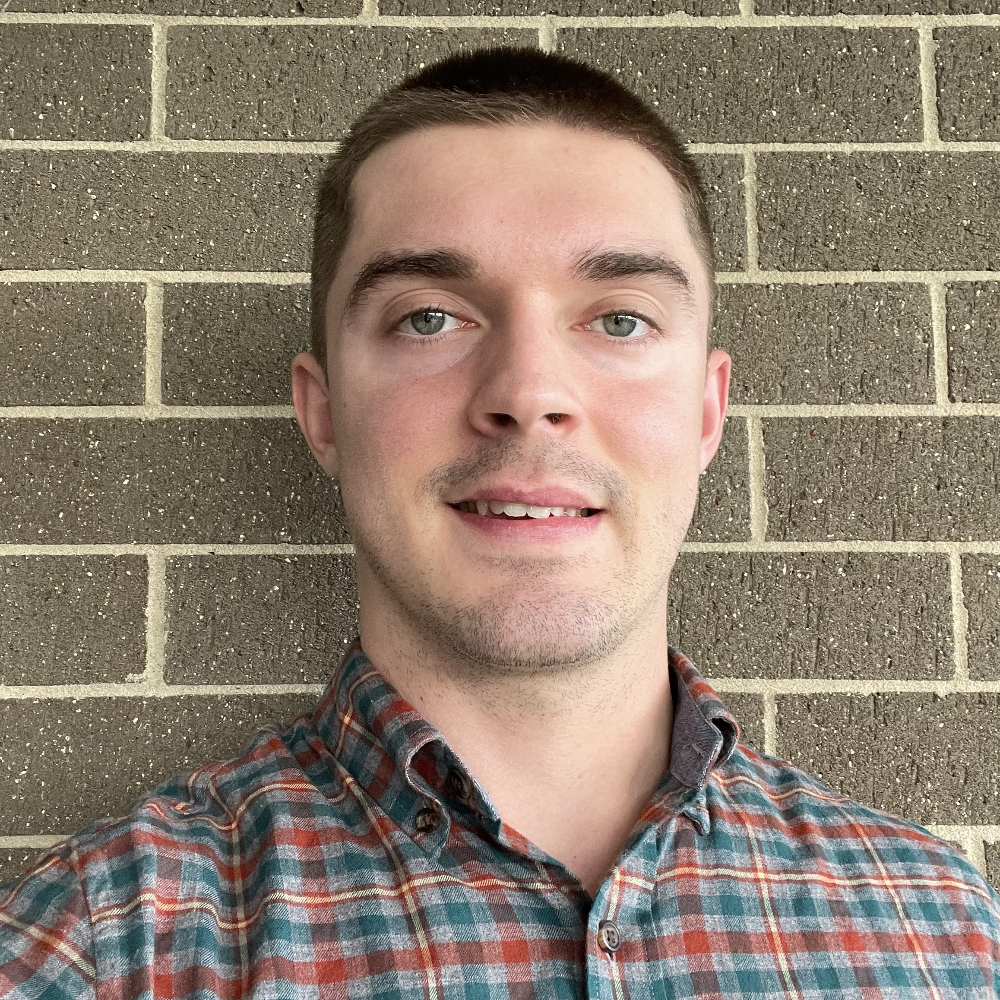

[Home](https://max-carter-math.github.io) | [Publications](./publications.html) | [Conferences & Talks](./conf_talks.html) | [Teaching](./teaching.html) | [Curriculum Vitae](./CV.pdf) | [Miscellaneous](./other.html)

|  | Max Carter   Email: max.carter@newcastle.edu.au   Address: School of Mathematical and Physical Sciences,   University of Newcastle,   Callaghan, NSW, 2308,   Australia |
                           
I am a research student at the University of Newcastle in Australia currently completing my Master's degree in mathematics. I am supervised by [Prof. George Willis](https://www.newcastle.edu.au/profile/george-willis#career) and work with other members of the [Zero-Dimensional Symmetry](https://zerodimensional.group/) research group here in Newcastle. 

My research interests lie firmly in the fields of group theory and operator algebras. More specifically, I'm interested in the study of locally compact groups, their representation theory and related problems concerning operator algebras. I am also interested in operator algebras and Hopf algebras as topics in themselves.

